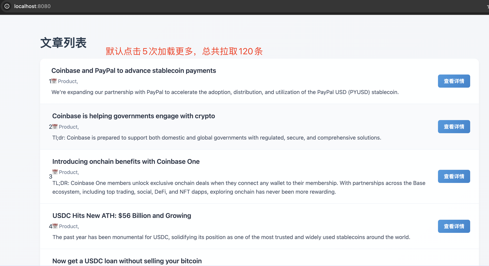

## Feature
**1. support proxy IP address**  
通过传入构造函数config.proxyList，爬虫每次启动执行是自动随机挑选代理ip，降低被封锁ip概率。后续可继续扩展实现自动排除已被封锁代理ip等。
**2. can handle web of pagination and infinite scroll**  
通过扩展实现BaseScraper的getLoadMoreConfig方法，来指明该种页面爬虫是需要无限滚动加载、还是翻页。具体可参照代码中的CoinbaseScraper类，内置默认查取5次滚动加载。
**3. simulate human scroll and delay operation**  
BaseScraper中统一实现爬虫工作时，打开web页面后，会等待页面加载； 模拟用户滚动等。
**4. contain a react web and koa server to display scraper results**  
参见Web目录和Server目录
**5. ci**  
每次pull request，会运行检查脚本pre-deploy.js，用于检查合并后代码是否影响主线功能


## Code Implement
**1. Scraper**  
BaseScraper: 实现了主要的爬虫流程，包括打开web页面，翻页/无限滚动；并且约定了解析html的接口签名。
CoinbaseScraper: 继承BaseScraper，自定义了解析html获取结果的逻辑。

**2. Web**   
使用react展示爬取的结果列表数据

**3. Server**  
使用nodejs开发的api server，为web端提供爬虫结果数据接口


## Screenshot
- 爬虫结果展示截图



## Develop
```shell
npm install
npm run start
```

